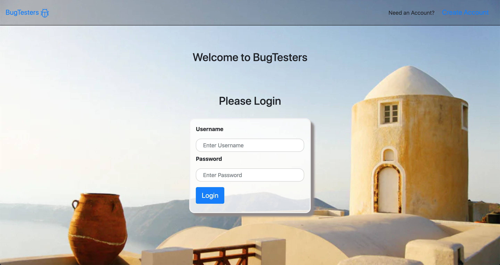
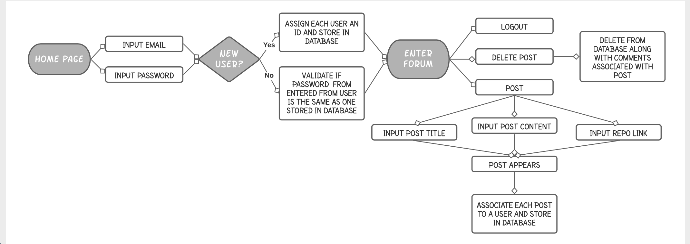

# BugTesters



# Link to Application
[VIEW OUR WORK HERE!](https://agile-brushlands-37017.herokuapp.com/login)


## Table of Contents

* [Description](#Description)
* [Flow Chart](#Flow-Chart)
* [Setup](#Setup)
* [Technologies Used](#Technologies-Used)
* [Future Improvements](#Future-Improvements)
* [Collaborators](#Collaborators)


## Description

This application is a forum for coders to go and post coding challenges. The application will be able to store logins (username and password) as well. 

This application utilizes Node and Express for web servers and is backed by MySQL database with a Sequelize ORM. The appication is deloyed using Heroku. 


## Flow Chart



## Setup

Clone the repositoy 
```bash 
git clone https://github.com/chris31roc/project2.git
```

Invoke the app in your terminal
```bash
node server.js
```

Install dependencies
```bash
npm i
```


## Technologies Used

- HTML
- CSS
- Javascript
- NPM Express
- NPM Express Handlebars
- NPM MySQL
- NPM Sequelize


## Future Improvements

* Addition of a comment feature for feedback.

* Develop different forums for different coding topics such as JavaScript, Ruby, HTML, etc.

* Expand on user profiles so that users can upload profile pictures or make their own avatar

* Develop more features for users to interact with each other such as a button for like, dislike, and reactions.


## Collaborators
**Chris Hicks**: team captain, front end & floater

- Github: [chris31roc](https://github.com/chris31roc)

- Email: chris31roc@yahoo.com

**Muhammad Usman**: front end

- Github: [usman3278](https://github.com/usman3278)

- Email: usman327820@gmail.com

**Kyle Barrand**: demo powerpoint

- Github: [kbear3](https://github.com/kbear3)

- Email: kyleb3@vt.edu

**Walter Leiva**: back end
   
- Github: [wleivax](https://github.com/wleivax)

- Email: leivawalt@gmail.com

**Nikki Nguyen**: back end and flow chart 
   
- Github: [technikks](https://github.com/technikks)

- Email: nguyen.nikki@hotmail.com
