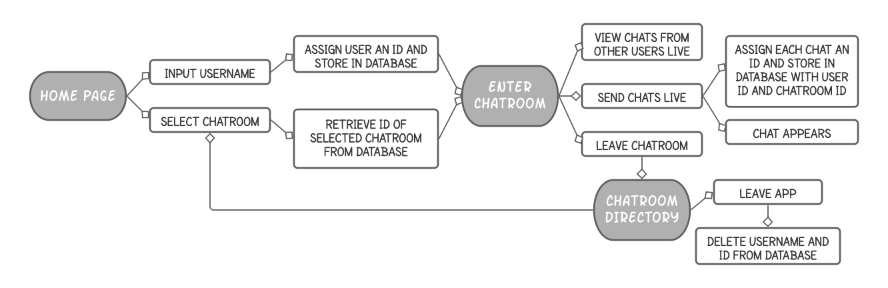

# Bug Tester
" * Photo of Application will go here * "


# Link to Application
[VIEW OUR WORK HERE!]()


## Table of Contents

* [Description](#Description)
* [Flow Chart](#Flow-Chart)
* [Setup](#Setup)
* [Technologies Used](#Technologies-Used)
* [Future Improvements](#Future-Improvements)
* [Collaborators](#Collaborators)


## Description

This application is a forum for coders to go and post coding challenges. The application will be able to store logins (username and password) as well. 

This application utilizes Node and Express for web servers and is backed by MySQL database with a Sequelize ORM. The appication is deloyed using Heroku. 


## Flow Chart



## Setup

Clone the repositoy 
```bash 
git clone https://github.com/chris31roc/project2.git
```

Invoke the app in your terminal
```bash
node server.js
```

Install dependencies
```bash
npm i
```


## Technologies Used

- HTML
- CSS
- Javascript
- NPM Express
- NPM Express Handlebars
- NPM MySQL
- NPM Sequelize


## Future Improvements

Coming Soon 


## Collaborators
**Chris Hicks**: team captain, front end & floater

Github: [chris31roc](https://github.com/chris31roc)

Email: chris31roc@yahoo.com

**Muhammad Usman**: front end

Github: [usman3278](https://github.com/usman3278)

Email: usman327820@gmail.com

**Kyle Barrand**: demo powerpoint

Github: [kbear3](https://github.com/kbear3)

Email: kyleb3@vt.edu

**Walter Leiva**: back end
   
Github: [wleivax](https://github.com/wleivax)

Email: leivawalt@gmail.com

**Nikki Nguyen**: back end and flow chart 
   
Github: [technikks](https://github.com/technikks)

Email: nguyen.nikki@hotmail.com
